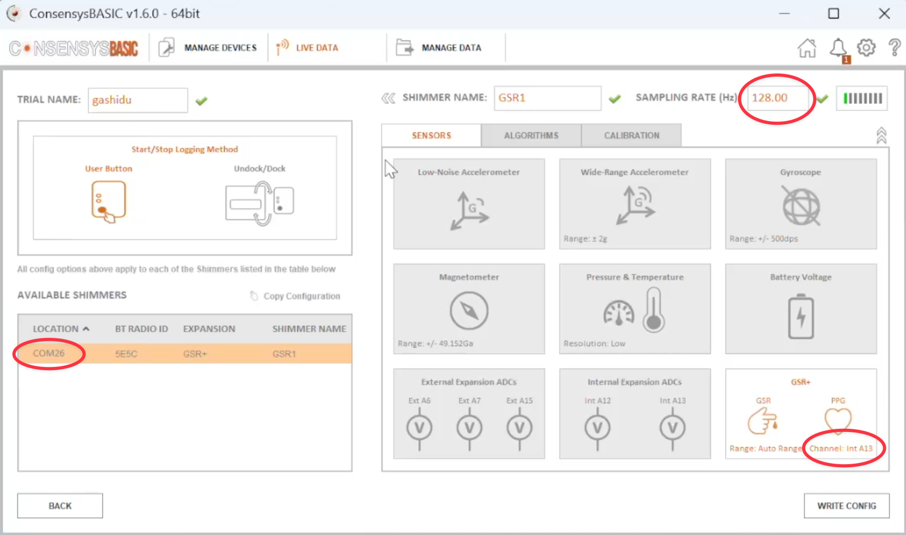
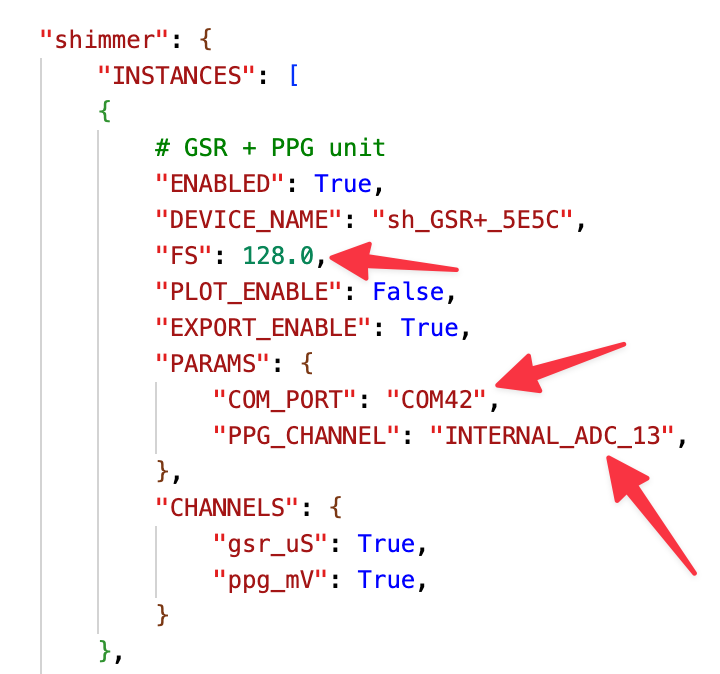
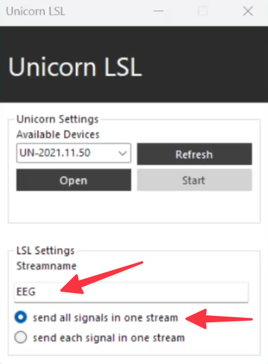
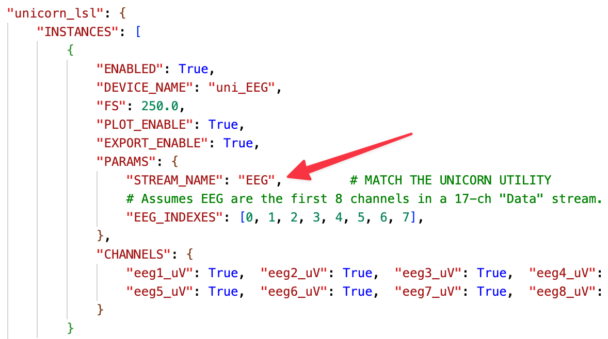

# USER_GUIDE.md

# 1. Introduction

## Purpose
This guide explains how to install, run, and safely operate the software to acquire, synchronize, visualize, and export physiological signals. It focuses on practical, step-by-step usage for end users and experimenters.

## What the software does (high level)
The application **acquires** signals from one or more devices:
- **Shimmer** sensors acquiring:
    -  Galvanic Skin Response (GSR),
    - Photoplethysmography (PPG),
    - Electromyography (EMG);
- **Unicorn Hybrid Black headset** acquiring Electroencephalography (EEG)

The signals can be **filtered in real time**, and aligned onto a unified time grid.
It is possible to record **sticky events** and **instant triggers** (spikes).

**Live plots** and **CSV exports** for post-processing are provided.

## Key capabilities
- **Multi-source acquisition:** Read from heterogeneous devices with different sampling rates and timestamps. Now available for the following devices:
    - **Shimmer3 GSR+ Unit** (*PPG and GSR signals*)
    - **Shimmer3 EXG Unit** (*2‑channel EMG signal*)
    - **g.tec Unicorn Hybrid Black** (*8‑channel EEG signal*)
- **Time synchronization:** Quantized timebase with bounded buffering and backpressure safety.  
- **Real-time filtering:** Notch and band-pass filters.  
- **Event & trigger logging:** Sticky events (state preservation) and instantaneous spikes (instant triggers).  
- **Live visualization:** Real-time signal and marker (events and spikes) plots with autoscale over the visible window.  
- **CSV export:** Asynchronous CSV writer with periodic flushing and idle detection.  
- **Telemetry & logging:** Centralized logs and periodic health checks.

## What is not included
- Offline analytics or statistics beyond CSV export.  
- Device configuration tools: communication is only oriented toward acquisition (read-only).  
- Automated device and configuration discovery.
- A graphical user interface.

## Supported platforms (overview)
- **Operating systems:** The project runs entirely in a Python environment and is, in principle, compatible with multiple operating systems.  
  It has been fully tested on **Windows 11**, which is the recommended platform.  
  The **g.tec Unicorn Hybrid Black** headset is **Windows-only**, as its official LSL module is supported exclusively on Windows.  
  Other sensors (e.g., Shimmer devices) will be tested on additional operating systems in future validation phases.
- **Python:** (tested) Version **3.13.7**
- **Python packages:** *see below*.
- **Devices:** (tested)
    - **Shimmer3 GSR+ Unit** (*PPG and GSR signals*) via `pyshimmer` library
    - **Shimmer3 EXG Unit** (*2‑channel EMG signal*) via `pyshimmer` library
    - **g.tec Unicorn Hybrid Black** (*8‑channel EEG signal*) via official LSL tools

> Detailed operating-system notes, Python constraints, and device dependencies are listed below in **System Requirements**.

## Typical use cases
- Running a lab session where multiple sensors are recorded and the operator adds triggers, which can be either **instant spikes** (one-shot markers) or **events** (state changes).
- Collecting synchronized data for downstream future analysis.

## Version
- **Current version:** 0.9.0 (Beta) — feature complete, under testing, and awaiting GUI integration.
- **Changelog:** See the repository releases page.

---

# 2. System Requirements

### 2.1 Operating systems
- **Windows 11 (recommended):** Fully compatible and tested with Shimmer3 and Unicorn Hybrid Black devices.  
- **macOS 13+ / Linux Ubuntu 22.04+:** Supported for simulation modules (*e.g., DemoRand*) only. **Hardware drivers for Shimmer and Unicorn are not officially supported** on these platforms.  
- Administrative rights may be required to install device drivers.

### 2.2 Hardware
- **Processor:** Multi-core CPU, **≥ 3.0 GHz** recommended. A higher-performance processor ensures smooth operation when multiple devices or high-frequency streams are active.  
- **Memory:** **8 GB RAM minimum**.
- **Storage:** Minimum 500 MB of free space for logs and temporary files; several GB are recommended for long recordings.  
- **Bluetooth connectivity:** A **high-quality Bluetooth 5.0 or newer adapter** with extended range is strongly recommended for stable communication with acquisition devices. If the built-in Bluetooth adapter has limited range or instability, use an **external USB Bluetooth module** with enhanced gain and certified drivers.
    > **<u>g.tec Unicorn Hybrid Black only works with the provided Bluetooth adapter (see EEG documentation for details)</u>**
- **Power management:** Keep the system plugged into AC power during acquisition to ensure consistent performance.

### 2.3 Python environment
- **Interpreter:** (tested) Python 3.13.7 (64-bit).  
- **Environment management:** A dedicated virtual environment is recommended to isolate dependencies.  
- **Package manager:** (tested) pip ≥ 25.0.

### 2.4 Required packages
All dependencies are **verified and installed automatically** at startup through the project’s `requirements.txt` file.  

Manual installation can be performed using the following command inside the project environment:
```bash
pip install -r requirements.txt
```

#### Key runtime libraries (*listed in `requirements.txt`*)
- matplotlib 3.10.5 — real-time plotting and visualization.  
- numpy 2.3.2 — numerical processing and vectorized operations.  
- scipy 1.16.1 — signal-processing filters and analysis utilities.  
- pylsl 1.17.6 — Lab Streaming Layer communication (Unicorn EEG).  
- pyserial 3.5 — serial communication with Shimmer devices.  
- pyshimmer 0.7.0 — open-source Shimmer SDK interface and data decoding.


# 3. Installation

### 3.1 Quick Start (recommended)
Run the following commands in **Windows PowerShell** from inside the project folder:

```powershell
py -3 -m venv .venv
.\.venv\Scripts\Activate.ps1
python -m pip install --upgrade pip
```

### 3.2 Additional software (required)
- **Consensys (free version):** For Shimmer sensor configuration (sampling rate, enabled channels, and port identification).  
  Free download (last accessed 2025-12-03): https://www.shimmersensing.com/support/wireless-sensor-networks-download/

- **Unicorn Suite:** For initial pairing and LSL stream activation.  
  Free download (last accessed 2025-12-03): https://www.gtec.at/product/unicorn-suite/


### 3.3 Shimmer connection and configuration
To connect the device, simply enable Bluetooth and turn on the Shimmer device; go to _Settings > Bluetooth > Add new device_ and pair.  

The default sampling frequency for Shimmer devices is 128 Hz. However, it may vary depending on the application; **it is always better to check that the configuration in the code** (`settings.py`) **is correct and corresponds to the Shimmer device settings**. The correct parameters can be checked or changed using the _Consensys_ software.  
The key values are:
- **Sampling frequency** _(usually 128 Hz for GSR+ unit, 512 Hz for EXG unit)_
- **COM Port**: different for each device and Bluetooth adapter combination
- **Enabled sensors**
- **PPG Channel** for GSR+ unit _(usually A\_13, may be A\_12)_
- **EMG channels and bits** for EXG unit _(usually 24 bits, may be 16 bits)_

### 3.4 Unicorn Hybrid Black connection and configuration
To connect the device, follow these steps:
1. Open _Device Manager_, select your computer’s Bluetooth module: right-click > **Disable**.
2. Plug in the provided USB Bluetooth adapter.
3. In _Device Manager_, make sure that the adapter has been successfully recognized. If not, a reboot generally solves the issue.
4. In _Device Manager_, go to the Bluetooth section. Right-click **Generic Bluetooth Radio** > **Properties** > **Power Management**. Deselect **Allow the computer to turn off this device to save power**.
5. Proceed to connect the Unicorn to the PC using the _Unicorn Suite_ program.
> For any error or malfunction during the connection process, please refer to the Unicorn Suite documentation.

### 3.5 Configuration
The configuration file **`settings.py`** defines all essential keys and adjustable parameters. It can be edited to customize the system according to user needs. All project modules include **safe fallbacks** for missing values.  
> If issues arise or advanced customization is required, refer to [TECHNICAL_DOC.md](./TECHNICAL_DOC.md).

#### 3.5.1 Shimmer configuration
<p align="center">
  
  
</p>

Match the following parameters with the ones in the Consensys software:
- COM port
- Sampling frequency
- Enabled sensors (GSR, PPG, EMG)
- Correct channels (for PPG and EMG)

Below is a minimal example of how a sensor instance is defined inside `settings.py`:

```python
"shimmer": {
    "INSTANCES": [
        {
            "ENABLED": True,                # Activate this device
            "DEVICE_NAME": "sh_GSR_5E5C",   # Identifier used in plots/exports
            "FS": 128.0,                    # Sampling frequency
            "PLOT_ENABLE": True,            # Show signals in the live plot
            "EXPORT_ENABLE": True,          # Include signals in CSV export
            "PARAMS": {
                "COM_PORT": "COM42",        # Bluetooth/serial port
                "PPG_CHANNEL": "INTERNAL_ADC_13" # PPG channel matching Consensys software
            },
            "CHANNELS": {
                "gsr_uS": True,             # Enable GSR output
                "ppg_mV": True              # Enable PPG output
            }
        }
    ]
}
```


# 4. Typical Workflow
1. **Connect devices:** Power on the devices (e.g., Shimmer / Unicorn), ensure that Bluetooth is active, and pair each device if not already done.  
2. **Start acquisition:** Select sources and configure sampling frequencies, ports, and parameters in `settings.py`.  
3. **Monitor live plots:** Verify that each signal is visible and stable.  
4. **Mark events/spikes:** Use keyboard shortcuts or dedicated modules.  
5. **Export data:** Signal and marker CSV exports are enabled by default.


# 5. Launching the Application

Please, consider that some steps may be skipped depending on the devices you are using.

### 5.1 Start Unicorn LSL stream
- Open the _Unicorn LSL_ program (accessible also via the _Unicorn Suite_ program)
- Select **each channel in one stream**
- Define a stream name **matching the `settings.py` value**, default is _EEG_
- Click **Open**, then **Start**  

<p align="center">
  
  
</p>

### 5.2 Start acquisition
- If open, close Consensys software (it may interfere with Shimmer communication)
- Run the script via your editor’s GUI
- Alternatively, run the base command `python main.py` inside the project folder


# 6. Data Outputs

### 6.1 Signals CSV export scheme
`data/synced/synced_<session_id>.csv`

| Column | Type | Description |
|--------|------|-------------|
| **t_q** | float | Quantized global timestamp in seconds (shared across all sources). |
| **\<device:channel\>** | float | One column per enabled channel (e.g., `sh_5E5C_ppg_mV`, `uni_eeg1_uV`, `demo_rand_ch1`). Missing samples are left empty. |
| **event** | string | Sticky event active at that quantized instant (e.g., `TASK_1`, `REST`). Remains constant until a new event occurs. |
| **spike** | string | Instantaneous event label (e.g., `SPIKE_A`, `SPIKE_S`). Empty if not present. |

> Each row represents one quantized time instant. Empty cells indicate that the corresponding device had no sample at that moment.

### 6.2 Events & Spikes CSV export scheme
`data/markers/markers_<session_id>.csv`

| Column | Type | Description |
|--------|------|-------------|
| **t_q** | float | Quantized timestamp in seconds when the event change or spike occurred. |
| **event** | string | Event label. Present only for event updates. |
| **spike** | string | Spike label. Present only for spikes. |
| **source** | string | Origin of the event or spike (e.g., `keyboard`, `event_demo_1`). |

> This file is optimized for post-processing: it lists **only** time instants where an event or spike occurred, making it easier to segment and analyze sessions offline.

# 7. Troubleshooting
- **Device not detected:**
    1. Ensure that the device and Bluetooth are switched on.  
    2. Verify the correct configuration in `settings.py` (`ENABLED` flag, port, sampling frequency, and channel naming).  
    3. Try connecting to the device using the official software to confirm communication.

- **No plots / choppy plots:**
    1. Verify the `ui/PLOT_ENABLE` flag is set to `True` in `settings.py`.
    2. Verify the `devices/your_device/INSTANCES/PLOT_ENABLE` flag is set to `True` in `settings.py`.
    3. Bring devices closer to the computer.  
    4. Ensure that the sampling frequency matches between `settings.py` and the device settings (via official software).

- **Empty rows in CSV:**
    1. Check for weak device connections and avoid physical obstructions (e.g., metal or concrete) that may interfere with Bluetooth signals.  
    2. Ensure that the sampling frequency matches between `settings.py` and the device settings (via official software).

# 8. Versioning & Updates
- **Current version:** 0.9.0 (Beta) — feature complete, under testing, and awaiting GUI implementation.  
- **Changelog:** See the Git repository for published updates.

# 9. Appendix

### Keyboard shortcuts
**Inside the plot window:**
- **Alt + Q** or **close plot window** → terminate session.  
- **Event triggers** follow `"EVENT_KEYMAP"` in `settings.py`, for example:
    ```python
    "EVENT_KEYMAP": {
        "0": "REST",    # Default event
        "1": "TASK_1",
        "2": "TASK_2",
        "3": "TASK_3",
        "4": "TASK_4"
    }
    ```
- **Spike triggers** follow `"SPIKE_KEYMAP"` in `settings.py`, for example:
    ```python
    "SPIKE_KEYMAP": {
        "a": "SPIKE_A",
        "s": "SPIKE_S",
        "d": "SPIKE_D",
        "f": "SPIKE_F"
    }
    ```

**Inside the terminal:**
- **Ctrl + C** → terminate session.
